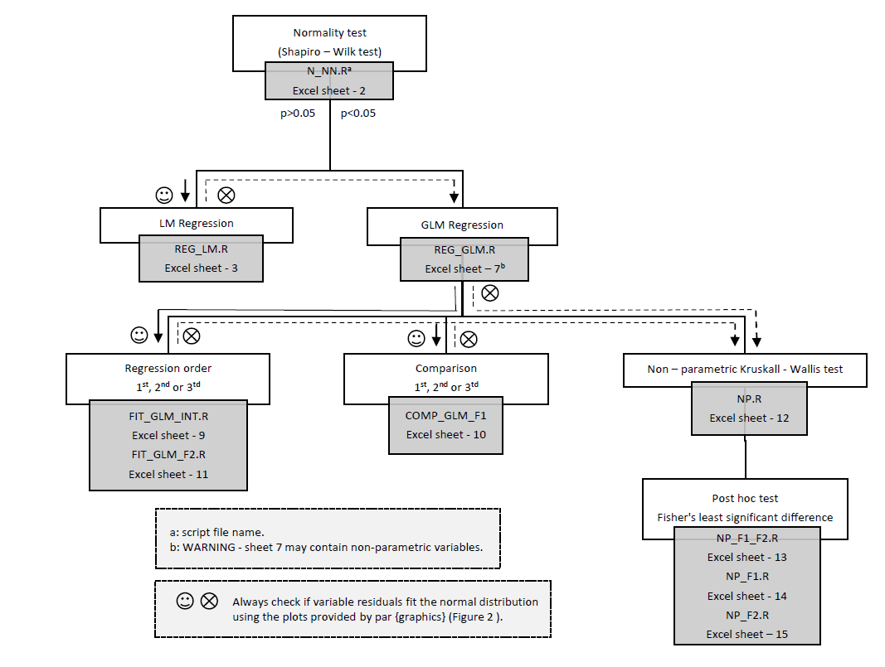
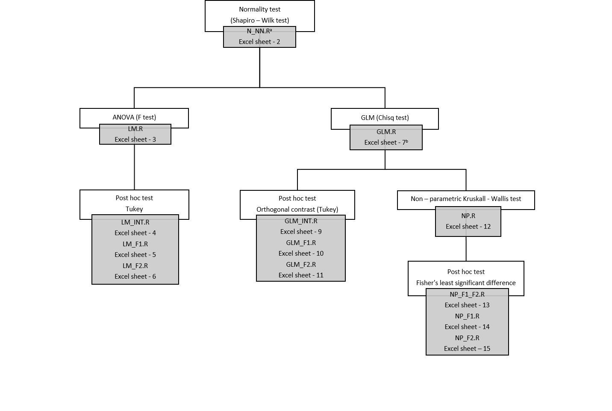

# Stats_Fp_GC

**Univariate statistical analysis of gas chromatography – mass spectrometry fingerprint analyses**

All variables in this repository were statistically tested using R and Rstudio (Version 1.1.453 – © 2009-2018 RStudio, Inc.). The peformed tests are a dependency of the packages: stats, xlsx , multcomp, lattice, agricolae, hnp, ExpDes  and, effects.

## experiments

Repository files are divided by experiments.

1.	Nitrogen
1.	Soil_data

YOU CAN USE THE FLOWCHART PROVIDE AS GUIDE (see also attached PDF for an extra copy)

### Nitrogen

### Soil

## Usage instructions

Excel “R_FILE” is how our dataset was built to run the R scripts

R_FILE was divided in sheets, e.g., 

Sheet_1

Named: 1_Details - Main effects and compound name abbreviations

Sheet_2

Named: 2_N_NN - All dataset and how to build your table to scripts work

After running the stats the subsequent sheets were filled according to the results.

Thus, the R_script files were saved separately. In other words, each R script file runs specifically in one excel sheet

E.g., after running the normality script, file name “N_NN”, two new sheets were built: 3_LM and 7_NN

In the LM types of response the scripts “LM” or “LM_EFFECTS” were used,
and according to the results the following sheets are filled with the variables: 4_LM_INT, 5_LM_F1 and 6_LM_F2

In the sheet 7_NN the script “GLM” were used,
and looking at the results using the command `plot(glm object)`
the sheets 8_GLM, 9_GLM_INT, 10_GLM_F1, and 11_GLM_F2 and 12_NP were filled with the variables.

In the sheet 12_NP using the script “NP” the following sheets were filled with the variables:
13_NP_F1_F2, 14_NP_F1 and 15_NP_F2.

The post hoc test scripts run in their specific sheet.
THE SCRIPT FILE NAMES AND SHEETS HAVE THE SAME NAME.

OBS: When analysing the main effects (F1 and F2) separately with comparisons within the levels in the LM or GLM types of response,
the script files “LM_EFFECTS” and “GLM_EFFECTS” do not provide the stats of F2 as whole.
Thus, we can only filled the sheets, 4_LM_INT, 5_LM_F1, 9_GLM_INT, and 10_GLM_F1 with the variables.
